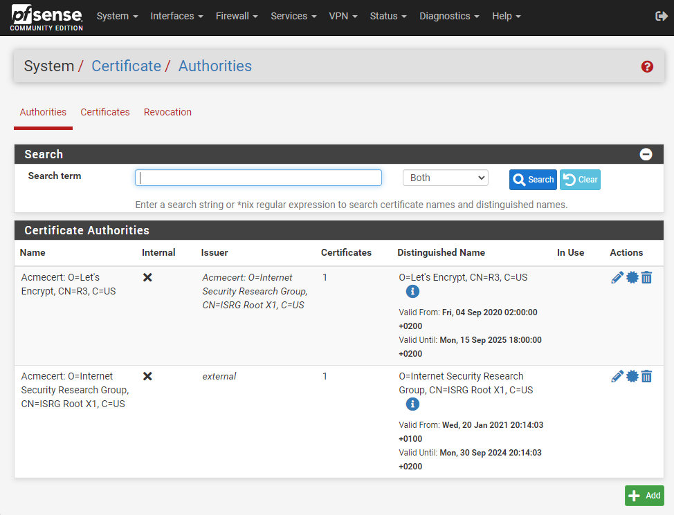

pfsense_tailscale_certificates_renewal
======================================

Shell scripts designed to install certificates that were not generated using pfSense's ``acme`` module.

While there are proposed solutions that involve directly editing the ``config.xml`` file with scripts, it is important to note that modifying the config.xml
file directly is a delicate operation and should be approached with caution.

If you choose to install such scripts, be sure to create a backup of the config.xml file before making any changes.

Here, we install certificates from Tailscale, but you can customize these scripts for your
specific application to import any other certificate. This process utilizes the ``acme-command.sh``
from the acme package, eliminating the need for direct manipulation of the ``config.xml`` file.

skills You need to implement these scripts :
    - basic knowledge of the shell
    - some access via ``ssh`` to transfer files and issue commands
    - access to the firewalls web interface

prerequisites:
    - install and configure package ``tailscale`` on pfsense (if You want to use tailscale vpn)
    - if You dont use ``tailscale``, some method to copy your certificates to the firewall

preparation:
    - install package ``cron`` on pfsense
    - install package ``acme`` on pfsense

notes:
    - please note that ``pfsense`` needs ``<LF>`` line endings in scripts, ``<CR><LF>`` will not work.

step-by-step guide:
    - fill out the correct values in our `config.sh`
    - copy the files for instance to ``/usr/local/pkg/tailscale-cert``.
      We suggest to use ``bitvise`` ssh client and ``sftp``
    - enter the shell on pfsense, and get root by ``su``
    - set permissions : ``chmod -R 0755 /usr/local/pkg/tailscale-cert``
    - fetch certificates : ``/usr/local/pkg/tailscale-cert/renew_tailscale_certificates.sh``
    - if You look now, the ``lets encrypt``  root and intermediate certificate should be visible in the web gui

-------

Changelog

v.1.0.0     release
